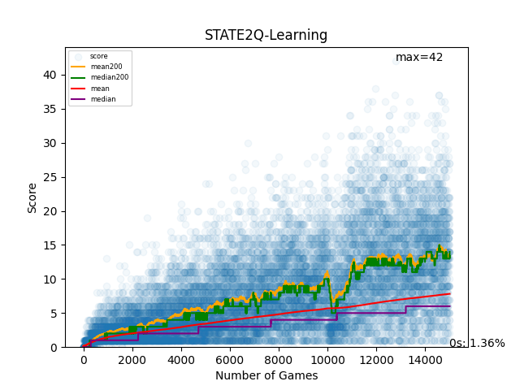
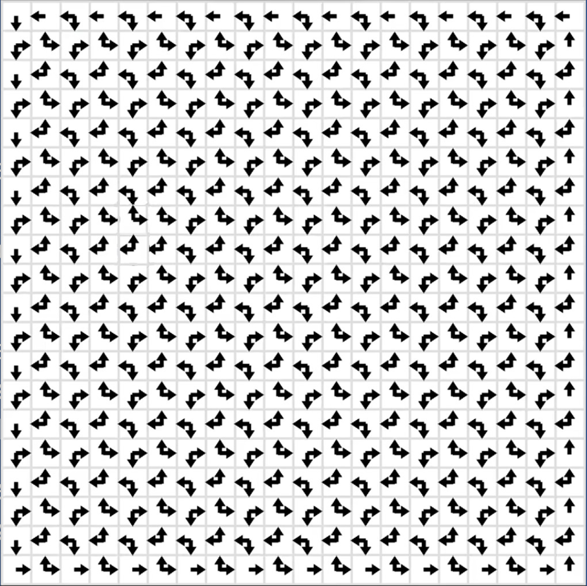

<h1 align="center">Snake Game</h1>
<h2 align="center">Reinforcement Learning - Avaliação Final</h2>

<h3> Participantes do grupo: </h3>

<a href = "https://github.com/CarCesar"> Carlos César Fonseca <a/>
 
<a href = "https://github.com/FabricioVenturim"> Fabrício Dalvi Venturim <a/>
 
<a href = "https://github.com/TFrankeM"> Thiago Franke Melchiors <a/>

<a href = "https://docs.google.com/presentation/d/1LqYL60JlXZVBTLjXx8VFTsdnT_2GUDTQqEZTPWXM7JU/edit?usp=sharing"> Slides da Apresentação <a/>

<h3> Sumário: </h3>

- [Modelos Tabulares](#modelos-tabulares)
- [Rede Neural](rede-neural)
- [Heuristico](Heuristico)
  

# [Modelos Tabulares](tabular)

Os modelos tabulares de RL utilizam tabelas para armazenar os valores que indicam qual ação o agente deve tomar em cada um dos estados.

Essas tabelas são uma representação de todos os estados possíveis cruzados com todas as ações possíveis. Geralmente, elas são inicializadas com todas as entradas zeradas e, à medida que o agente interage com o ambiente, os valores são atualizados para refletir as melhores decisões a serem tomadas.

## Modelos

Existem vários modelos tabulares para RL, cada um com suas particularidades. No entanto, optamos por utilizar dois deles: o Q-Learning e o SARSA. Embora esses modelos sejam muito semelhantes, uma pequena diferença entre eles pode afetar significativamente os resultados.

Ambos os modelos determinam a melhor ação para um estado específico procurando o valor máximo na tabela. Além disso, eles incorporam uma taxa de exploração (epsilon) que permite que o agente siga caminhos aleatórios de vez em quando, a fim de evitar ficar preso em máximos locais. No contexto do jogo da "Cobrinha", a exploração desempenha um papel fundamental na prevenção de loops infinitos.

Apesar das semelhanças, a principal diferença entre esses modelos reside na forma como eles atualizam os valores da tabela. Ambos utilizam a equação de Bellman para atualizar os valores, mas o Q-Learning calcula o máximo valor futuro, enquanto o SARSA considera a próxima ação antes de atualizar o valor do estado atual. Aqui estão as equações de Bellman para cada modelo:

#### Q-Learning
$$Q(S_t,A_t) \leftarrow Q(S_t,A_t) + \alpha [R_{t+1} + \gamma \max_{a} Q(S_{t+1},a) - Q(S_t,A_t)]$$

#### SARSA (State, Action, Reward, State, Action)
$$Q(S_t,A_t) \leftarrow Q(S_t,A_t) + \alpha [R_{t+1} + \gamma Q(S_{t+1},A_{t+1}) - Q(S_t,A_t)]$$

## Ações

Um dos primeiros passos a serem tomados é a definição do espaço de ações que o agente pode tomar. No contexto do jogo da "Cobrinha", pode parecer intuitivo que existam 4 movimentos possíveis ($\leftarrow, \uparrow, \rightarrow, \downarrow$). No entanto, essa conclusão é equivocada. Quando a cobra faz um movimento para cima ($\uparrow$), ela não pode imediatamente descer ($\downarrow$). Portanto, restam apenas 3 movimentos ($\leftarrow, \uparrow, \rightarrow$). Além disso, o fato de não poder ir na direção oposta à atual sempre ocorre. Portanto, foi preferível utilizar 3 ações, sendo elas relativas à cabeça. As ações possíveis são seguir em frente ($\uparrow$), virar à direita ($\rightarrow$) e virar à esquerda ($\leftarrow$).

## Estados
### State 1 - Valores Absolutos

  -  Perigo para cada direção
  -  Direção do passo anterior
  -  Direção em relação à comida

### State 2 - Distância Relativa

  -  Perigo para cada ação
  -  Distância relativa à comida

### State 3 - Direção Relativa

  -  Perigo para cada ação
  -  Direção relativa à comida

## Recompensas

Testamos diferentes recompensas, mas a que teve melhor resultado foi:

  -  Penalizamos o modelo em 10 quando morria.
  -  Beneficiamos o modelo em 5 quando comia a fruta.
  -  Não fizemos nada quando ele apenas se movimentava.

## Melhores Modelos
### Q-Learning - Estado 2

Este modelo foi um dos melhores e alcançou:

- Média (nos últimos 200): 13.8
- Mediana (nos últimos 200): 14
- Percentual de jogos zerados: 1.36%

Pelo gráfico e pelas métricas, temos a ideia de que, com o passar do tempo, o agente melhora sua performance. Além disso, a "Cobrinha" quase nunca terá score 0.

#### Vídeo

A seguir, você pode ver o resultado do jogo através do vídeo:

https://github.com/FabricioVenturim/Snake-RL/assets/73307575/f312de45-64c2-48c3-8781-a7b7ab1a6f3e

### SARSA - Estado 3

Este modelo foi o melhor e conseguiu:

-  Média (nos últimos 200): 66.1
-  Mediana (nos últimos 200): 65
-  Máximo: 142

Pelo gráfico e pelas métricas, vemos que a "Cobrinha" cresce e aparentemente se mantém nesse nível.

#### Vídeo

A seguir, você pode ver o resultado do jogo através do vídeo:

https://github.com/FabricioVenturim/Snake-RL/assets/73307575/43e60db5-0122-49cb-b396-69d1c7c06d64

# [Rede Neural](rede_neural)

## Deep Q-Learning

Os métodos tradicionais de Reinforcement Learning (RL), como os modelos tabulares, têm limitações quando lidam com ambientes complexos e de grande dimensionalidade. O **Deep Q-Learning (DQN)** surge como uma evolução ao incorporar redes neurais profundas para lidar com tais desafios.

### Modelo

O DQN utiliza uma arquitetura de rede neural para aproximar a função Q, que atribui valores a pares estado-ação. Em vez de armazenar valores em tabelas, como nos modelos tabulares, a rede neural é treinada para prever os valores Q. A arquitetura típica consiste em uma camada de entrada representando o estado, uma ou mais camadas intermediárias (ocultas) e uma camada de saída para cada ação possível.

A função de perda é calculada usando a equação de Bellman, semelhante aos modelos tabulares, mas agora aplicada à saída da rede neural. 

$$Q(S_t,A_t) \leftarrow Q(S_t,A_t) + \alpha [R_{t+1} + \gamma \max_{a} Q(S_{t+1},a) - Q(S_t,A_t)]$$

A atualização dos pesos ocorre através do algoritmo de otimização, como o Gradiente Descendente.

$$Loss = E[(Q(S_t, A_t) - (R_{t+1} + γ max_a Q(S_{t+1}, a)))^2]$$ 

## Ações

Um dos primeiros passos a serem tomados é a definição do espaço de ações que o agente pode tomar. No contexto do jogo da "Cobrinha", pode parecer intuitivo que existam 4 movimentos possíveis ($\leftarrow, \uparrow, \rightarrow, \downarrow$). No entanto, essa conclusão é equivocada. Quando a cobra faz um movimento para cima ($\uparrow$), ela não pode imediatamente descer ($\downarrow$). Portanto, restam apenas 3 movimentos ($\leftarrow, \uparrow, \rightarrow$). Além disso, o fato de não poder ir na direção oposta à atual sempre ocorre. Portanto, foi preferível utilizar 3 ações, sendo elas relativas à cabeça. As ações possíveis são seguir em frente ($\uparrow$), virar à direita ($\rightarrow$) e virar à esquerda ($\leftarrow$).

## Estados
### State 1 - Valores Absolutos

  -  Perigo para cada direção
  -  Direção do passo anterior
  -  Direção em relação à comida

### State 2 - Distância Relativa

  -  Perigo para cada ação
  -  Distância relativa à comida

### State 3 - Direção Relativa

  -  Perigo para cada ação
  -  Direção relativa à comida

## Recompensas

Testamos diferentes recompensas, mas a que teve melhor resultado foi:

  -  Penalizamos o modelo em 10 quando morria.
  -  Beneficiamos o modelo em 10 quando comia a fruta.
  -  Não fizemos nada quando ele apenas se movimentava.

### Testes

Fizemos diferentes testes, mas os que são válidos apresentar são:

#### 1. Cobrinha sem crescer

Nosso primeiro teste foi usando o modelo em uma cobrinha que não cresce. O resultado foi que ela logo aprendeu e parou de morrer depois de poucas iterações:

https://github.com/FabricioVenturim/Snake-RL/assets/86852019/b36cf7de-a6cf-4f76-a421-5fbf063f5ff9

#### 2. Cobrinha crescendo

Agora utilizamos o mesmo modelo para a cobrinha crescendo. Em poucas iterações, ela convergiu para uma boa média, dada a simplicidade do modelo:

https://github.com/FabricioVenturim/Snake-RL/assets/86852019/479f7d64-d7ac-4963-a9db-5369ff172c69

# [Heuristico](Heuristico)

	 

